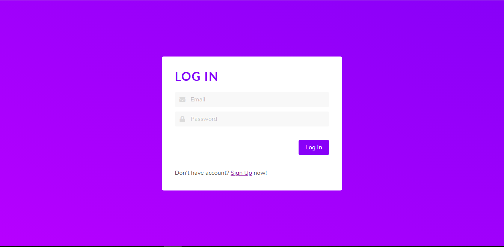
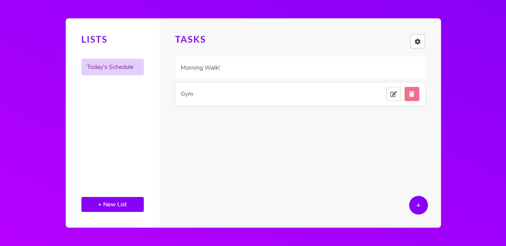

# Task-Manager

A MEAN stack application that is used to create & manipulate your to-do's and tasks with all CRUD operations on them and authorization for the users using JWT(Json Web Tokens).

Login Page and Signup Page Similar to this.

Dashboard where you can create lists and tasks in the corresponding lists.

